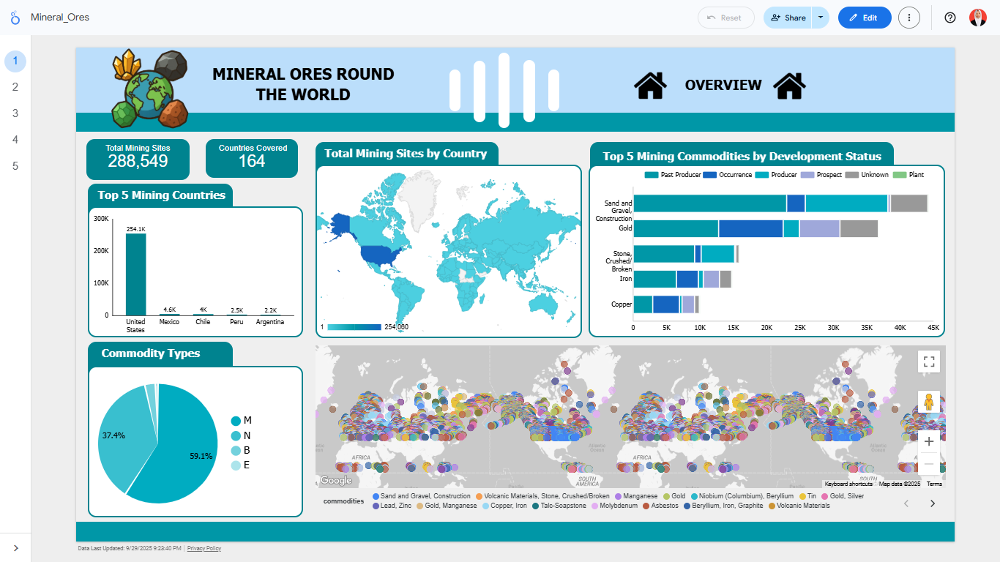
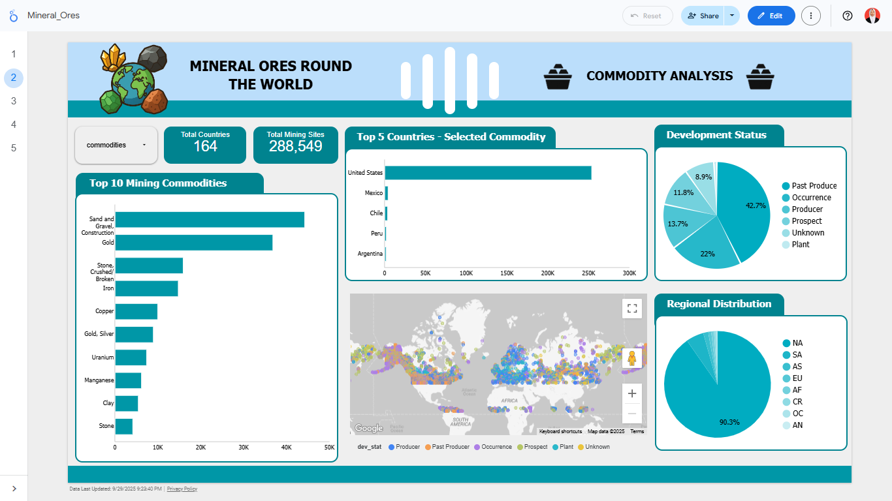
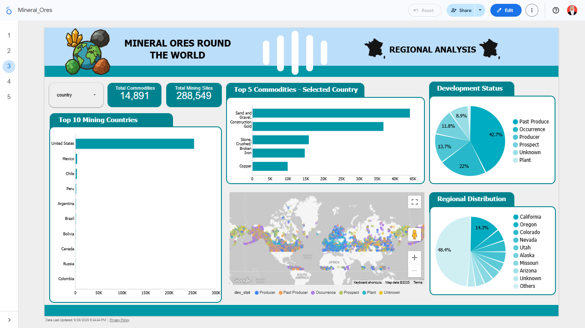
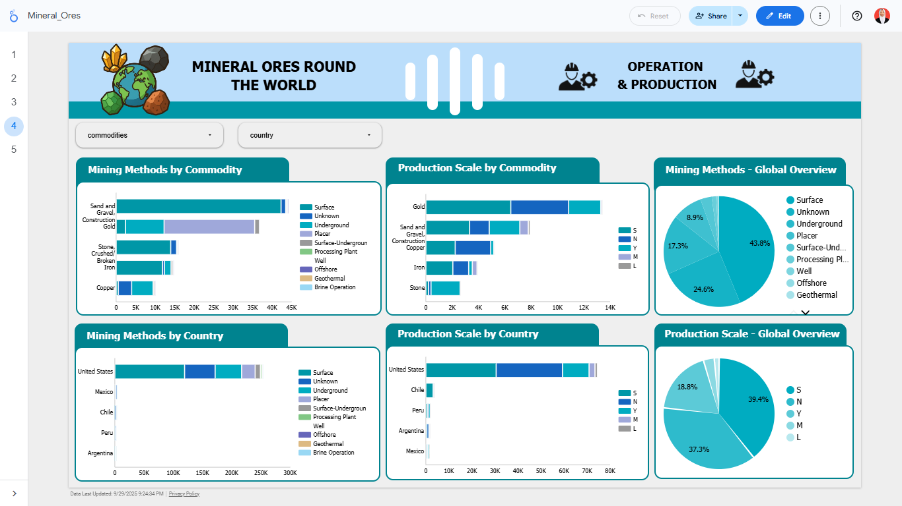
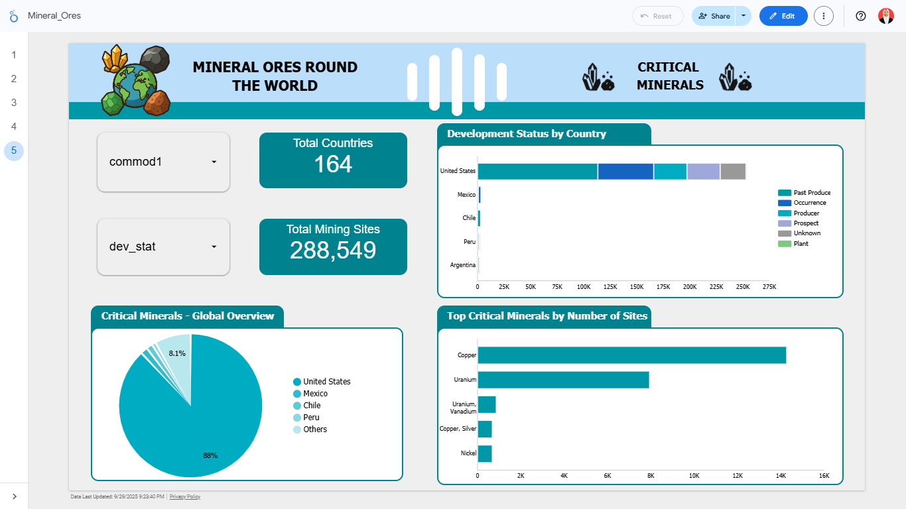

# 🌍 Global Mining Analysis

## 🎯 Objective
Analyze global mining distribution to identify key trends in commodities, mine status, and regional spread.

## 🛠️ Tools
- SQL (Google BigQuery)
- Google Looker Studio (dashboard)

## 📈 Key Findings
- 42.7% mines are past producers (inactive).  
- 90.3% of mines are located in North America.  
- Potential reactivation of old mines to support clean energy demand.  

## 📊 Dashboard
👉 [View Dashboard](https://lookerstudio.google.com/reporting/a82fc43a-4c02-425d-a45a-99d516fffb4e)

## 📊 Dashboard Screenshots

## 📂 Files 
- [`sql/mineral-ores.sql`](./sql/mineral_ores.sql): SQL queries used  
